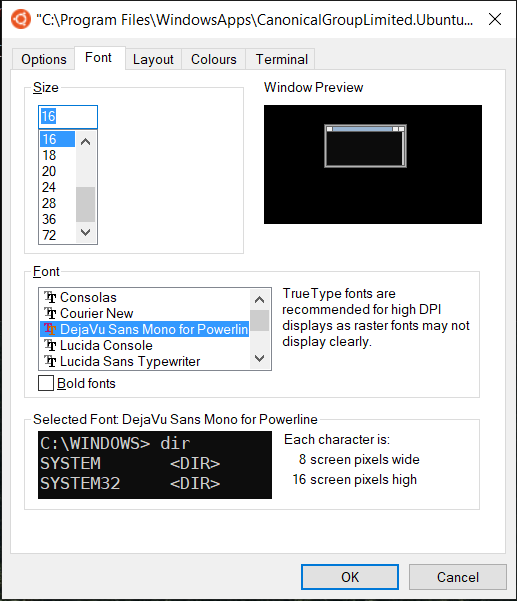
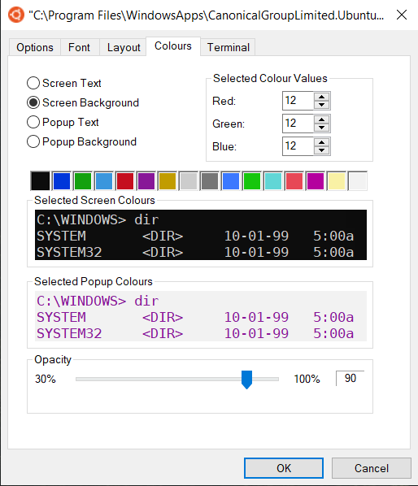

# WSL
Nice setup script for a basic Linux development environment

This development image is based on `Ubuntu-20.04`

## Installation

- Ensure that you have enabled WSL and that the default version is `V2`. See [this article](https://docs.microsoft.com/en-us/windows/wsl/install) for details:

- Install `Ubuntu-20.04`. This can be done two ways:
    - Install through the Microsoft Store
    - Install Manually: see [Custom foo description](#appendix:-installing-distro-without-the-microsoft-store)

- Install the powerline fonts - this will prettify your terminal!
    - Download the font file in this repo and install it on your system
    - Set the default preferences as follows:

 


- Run the install script in a fresh WSL Ubuntu installation
```bash
sudo sh -c "$(curl -fsSL https://wsl.bojit.org/install.sh)"
```

- Restart your terminal to have the new environment

## Preinstalled Tools

- `build-essential` : Basic compilers + linux make tools
- `ranger` : terminal file explorer
- `git` : version control
- `pipenv + pyenv` : Python virtual environments with **Pipfiles**.
- `nvm` : NodeJS version manager
- `docker` : Backend-daemon for containerised applications

## Useful Commands

- `sudo service docker start` : Start docker daemon. Needs to be done before you run/build containers


## TODO after Installation

- Setup SSH keys + Gitconfig: either setup from scratch in WSL or symlink to your Windows keys.

I like to do the following:
```bash
mkdir ~/Git                                         # Folder for Git repositories in WSL
ln -s /mnt/c/Users/<USER_NAME>/Git_Local Git_Local  # Symlink to local (Windows) Git repo folder
ln -s /mnt/c/Users/<USER_NAME>/Documents Documents  # Convenient shortcut to Windows documents

ln -s /mnt/c/Users/<USER_NAME>/.gitconfig .gitconfig    # Share gitconfig between Windows and WSL
# You can share any other convenient dotfiles here

# Due to file permissions in WSL mounted volumes, you cannot symlink your SSH keys. Just copy the keys to your WSL distro:
cp -r /mnt/c/Users/<USER_NAME>/.ssh ~/.ssh
chmod 600 ~/.ssh/id_rsa
```

## Appendix: Installing Distro without the Microsoft Store

Sometimes it is not possible to install Ubuntu from the Microsoft Store (particularly in corporate environments). However, the installation can be done manually in a local directory.

- Download `Ubuntu-20.04` manually from [https://aka.ms/wslubuntu2004](https://aka.ms/wslubuntu2004).

- Change the downloaded file extension from `.AppxBundle` to `.zip` and extract all.

- Find the enclosed file ending in `_x64.appx`, change to `.zip` and extract.

- Move this entire folder to a local location on your system: I like to use `c:\Users\\<USER_NAME\>\WSL\\<DISTRO_NAME\>

- Launch the `ubuntu.exe` in this folder: you may want to also pin a shortcut to this file in the start menu.

- Once installed ensure that your WSL version for that distro is set to `V2`.